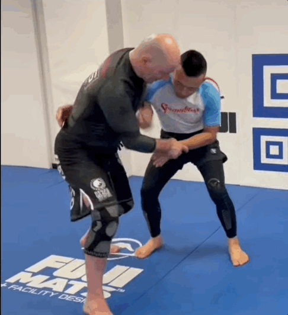

# Match breakdown

## Magnus Groa

### Guillotine forsøk

Sikre butterfly guard og strekk han ut mens du setter deg opp før du går for guillotine.

Som Marcello Garcia gjør her:

### Gripe muligheten for ashi / x-guard

Når motstander setter opp foten på den måten er det en perfekt annledning til å sette opp ashi eller x-guard.

Som Firas gjør her

### Uchi mata

God mulighet for uchi mata til takedown her

Som Danaher viser her:

### Grapevine Escape forsøk

Når du går for "grapevine escapen" her så knee slider motstander rett ut

Om det skal fungere må du isåfall blokke kneet med andre foten / sette inn butterfly som du gjør her og får en pen escape

Minner forøvrig litt om Marcello sin situp escape (merk her at han har frame og at det ikke er mulig å kneeslide ut).

### Guillotine Escape

Bra kjempet til escape her, men kan bli bedre.

Eksempel når han guarden er åpen som den var på slutten her:

