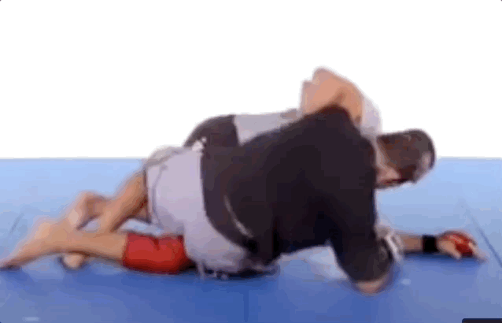

# Match breakdown
- [Jacob](#jacob)
  - [Foot Sweep](#foot-sweep)
  - [Guard Recovery](#guard-recovery)
  - [Kimura Escape/Counter](#kimura-escapecounter)
- [Adam](#adam)
  - [Guard pull og armbar mulighet](#guard-pull-og-armbar-mulighet)
  - [Butterfly Passering](#butterfly-passering)
  - [Underhook fra half guard](#underhook-fra-half-guard)
  - [Arm triangle escape](#arm-triangle-esacpe)
  - [Mount Escape](#mount-escape)
- [Magnus Groa](#magnus-groa)
  - [Guillotine forsøk](#guillotine-forsøk)
  - [Gripe muligheten for ashi / x-guard](#gripe-muligheten-for-ashi--x-guard)
  - [Uchi mata](#uchi-mata)
  - [Grapevine Escape forsøk](#grapevine-escape-forsøk)
  - [Guillotine Escape](#grapevine-escape-forsøk)
  - [Kimura takedown counter](#kimura-takedown-counter)
  - [Mer bestem](#mer-bestem)
  - [Full guard til x-guard](#full-guard-til-x-guard)
  - [Reis deg](#reis-deg)
  - [Re-guard](#re-guard)
  - [Half Guard](#half-guard)

## Jacob

### Foot Sweep

Du må fjerne grepet på hodet her. Han bruker det og at du lener mye av vekten din over på venstre foot til å sett opp en sweep. (Dårlig coaching av meg her ettersom jeg hører i lydklippet at jeg oppfordreg deg til å gå for snap her, sorry !)

### Guard Recovery

Du må få inn det nederste kneet her. Slik som du gjør det senere i klippet når du roterer rundt til den andre siden.

### Kimura Escape/Counter

Fin armbar escape først her, motstander bruker det til å sette opp en kimura. Når du forsvarer kimura gir det han en mulighet til å sette opp triangle.

Her kunne du har rullet gjennom for å fjerne presset eller kontrekt med armbar slik Matt Hughes gjorde på GSP:

For å escape side triangle må du "hente helen" med armen som er fri. Som vist av gordon nedenfor:

## Adam

### Guard pull og armbar mulighet

For ivrig på half guard pull her. Du puller når han har 100% kontroll på overkroppn din så alt han trenger for å passere er å steppe ut. 

Eksempel på half guard pull med lucas leite:

Det var og en mulighet for en armbar her om du hadde rotert med høyre kne inn mot motstander. Slik som Brian Glick viser her:

### Arm triangle esacpe

God frame på hoften her, men når du forsøker å gå i bro blir det mer som en hipthrust hvor du holder statisk. 

Du må gå i bro (ofte flere ganger) for å få motstander i ubalanse slik at de poster og  du kan få inn albuen igjen. Eksempel på gordon ryan som gjør det her:

### Mount Escape

Veldig bra mount escape forsøk her, ser ut som han roterer hoftene rett før du klarer å få inn ashi garami. Bare mer drilling så sitter den. Du reagrer veldig bra og bytter til en footdrag escape. For å fullføre den må du rotere hoftene inn mot motstander slik at kneet hans løftes fra bakken og du kan skyve det inn i halfguard igjen.

Danaher eksempel her:

### Butterfly Passering

Fjerne hodekontroll, og force half guard. Ser ut som du prøvde på det, men litt uforsiktig med armen her mtp at han har hodekontroll (motstander kunne ha satt opp en triangle om han hadde mer erfaring).

GPS passering i lignende situasjon

### Underhook fra half guard

Du må komme deg lengre ned mot beina hans ved å skyva armen dfin over skulderen. I tilleg må du passe på å frame crossfacen 

Slik som Noguiera gjør her:

Mtp at han hadde en dyp crossface kan det hende at vi skal jobbe med den her: 

https://youtube.com/shorts/hr3dwjwjacU?si=91uUkxo22v5jxz86

## Magnus Groa

### Guillotine forsøk

Sikre butterfly guard og strekk han ut mens du setter deg opp før du går for guillotine.

Som Marcello Garcia gjør her:

### Gripe muligheten for ashi / x-guard

Når motstander setter opp foten på den måten er det en perfekt annledning til å sette opp ashi eller x-guard.

Som Firas gjør her

Samme mulighet her, men fint guillotine forsøk.

### Uchi mata

God mulighet for uchi mata til takedown her

Som Danaher viser her:

### Grapevine Escape forsøk

Når du går for "grapevine escapen" her så knee slider motstander rett ut

Dejavu:

Om det skal fungere må du isåfall blokke kneet med andre foten / sette inn butterfly som du gjør her og får en pen escape

Minner forøvrig litt om Marcello sin situp escape (merk her at han har frame og at det ikke er mulig å kneeslide ut).

### Guillotine Escape

Bra kjempet til escape her, men kan bli bedre.

Eksempel når han guarden er åpen som den var på slutten her:

### Kimura takedown counter

Veldig bra reaksjon i starten, men du er nødt å få inn butterfly hooken og rotere hoftene bort fra han (istedenfor "turtle retning")

Slik som her:

### Mer bestem

Mer bestemt når du reiser deg her, få fotnen i bakken, evt sette kneet ned slik at du ender i half guard.

> La ikke merke til det før etterpå nå, men ganske kul move fra motstander her. Merk hvordan han han løfter foten din opp med hoften sin før han skyver den tilbake og reiser seg (ikke i klippet)

### Full guard til x-guard

For meg virker det som om du forsøker å sette opp en x-guard her. Bra tenkt, men må øves på.

Eksempel med Danaher:

### Reis deg

Du aksepterer takedownen her uten at han har skikkelig kontroll på deg her. Du kunne ha kjempet deg opp igjen istedenfor å sette deg til butterfly og tapt poeng.

### Re-guard

Går for "outside butterfly" her uten kontroll og hjelper egentlig han inn i passeringn. Her burde du re-guarde til butterfly istedenfor. 

Slik som marcello i situp escapen.

### Half guard

Fin setup av underhook her, men når du poster opp på den måten og "stikker ut" hodet er du åpen for guillotines og darce. 

Istedenfor å poste burde du gå for "leg scoop"

Som Gordon gjør her

Evt kunne du ha kontret med en knee lever direkte som her (kan gjøres når de setter opp darce og, men dette klippet var nærmeste jeg kom):

